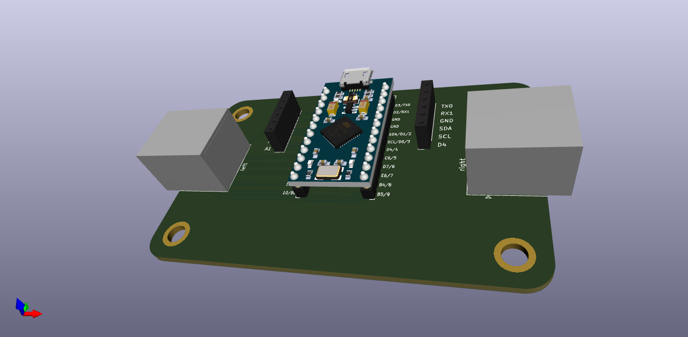

# The Japanese Connection

With the [Japanese duplex matrix](https://kbd.news/The-Japanese-duplex-matrix-1391.html) you can use less pins for more switches!
So with that in mind we made a hub that let you make split keyboards with no microcontroller, just good old RJ45 and ethernet cables!

## Development

Rember to run `git submodule update` when the [foostan/kbd](https://github.com/foostan/kbd) submodule has been updated.
